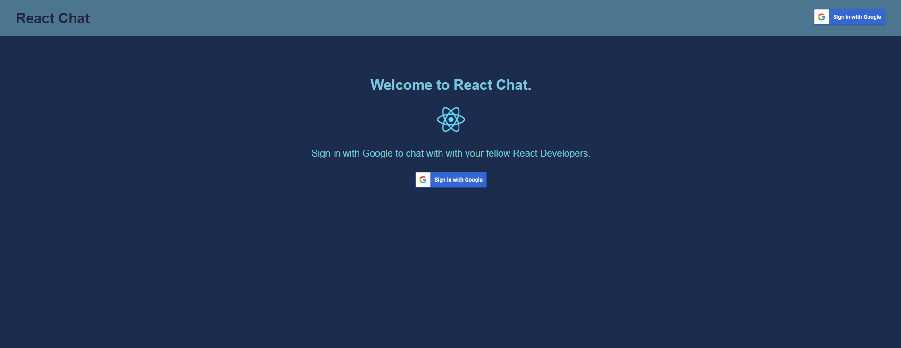

</img>
# 📗 Table of Contents

- [📖 About the Project](#about-project)
  - [🛠 Built With](#built-with)
    - [Tech Stack](#tech-stack)
    - [Key Features](#key-features)
  - [🚀 Live Demo](#live-demo)
- [💻 Getting Started](#getting-started)
  - [Setup](#setup)
  - [Prerequisites](#prerequisites)
  - [Install](#install)
  - [Usage](#usage)
  - [Run tests](#run-tests)
  - [Deployment](#triangular_flag_on_post-deployment)
- [👥 Authors](#authors)
- [🔭 Future Features](#future-features)
- [🤝 Contributing](#contributing)
- [⭐️ Show your support](#support)
- [🙏 Acknowledgements](#acknowledgements)
- [❓ FAQ (OPTIONAL)](#faq)
- [📝 License](#license)

<!-- PROJECT DESCRIPTION -->

# 📖 React Chat App <a name="about-project"></a>


**React Chat App** In the app, we will allow the user to log in with their Google account using Firebase's Google sign-in Authentication. We will also store and retrieve all the chatroom messages using Firebase's Cloud Firestore.

## 🛠 Built With <a name="built-with"></a>

### Tech Stack <a name="tech-stack"></a>

<details>
  <summary>Client</summary>
  <ul>
    <li><a href="https://react.dev/">React</a></li>
  </ul>
</details>

<details>
  <summary>Server</summary>
  <ul>
    <li><a href="https://console.firebase.google.com/">Firebase</a></li>
  </ul>
</details>


<!-- Features -->

### Key Features <a name="key-features"></a>


- **Google SignIn & signOut**
- **React-Firebase Connection**
- **Scrollable ChatBox**
- **Send Message and retrieve and display message**

<p align="right">(<a href="#readme-top">back to top</a>)</p>


## 🚀 Live Demo <a name="live-demo"></a>

Live <a href="https://chatbox-66dl.onrender.com/">link</a>


<p align="right">(<a href="#readme-top">back to top</a>)</p>

<!-- GETTING STARTED -->

## 💻 Getting Started <a name="getting-started"></a>


To get a local copy up and running, follow these steps.

### Prerequisites

In order to run this project you need:


```sh
 git init -y
```

### Setup

Clone this repository to your desired folder:


```sh
  cd my-folder
  git clone git@github.com:rabayarabu/react-chat-app.git
```

### Install

Install this project with:


```sh
  cd my-project
  git install
```

### Usage

To run the project, execute the following command:


```sh
  npm start
```

<p align="right">(<a href="#readme-top">back to top</a>)</p>

<!-- AUTHORS -->

## 👥 Authors <a name="authors"></a>


👤 **Author1**

- GitHub: [@rabayarabu](https://github.com/githubhandle)
- Twitter: [@rabaya_rabu](https://twitter.com/twitterhandle)
- LinkedIn: [LinkedIn](https://linkedin.com/in/rabaya-rabu-142721169/)


<p align="right">(<a href="#readme-top">back to top</a>)</p>

<!-- FUTURE FEATURES -->

## 🔭 Future Features <a name="future-features"></a>


- [ ] **Include more modules**


## 🤝 Contributing <a name="contributing"></a>

Contributions, issues, and feature requests are welcome!

Feel free to check the <a href="https://github.com/rabayarabu/react-chat-app/issues">issues</a>.

<p align="right">(<a href="#readme-top">back to top</a>)</p>

<!-- SUPPORT -->

## ⭐️ Show your support <a name="support"></a>


If you like this project, you are welcome to contribute or modify this project or give a star to inspire me.

<p align="right">(<a href="#readme-top">back to top</a>)</p>

<!-- ACKNOWLEDGEMENTS -->

## 🙏 Acknowledgments <a name="acknowledgements"></a>


I would like to thank <a href="https://www.freecodecamp.org/news/building-a-real-time-chat-app-with-reactjs-and-firebase/">FreeCodeCamp</a> for providing this documentation.

<p align="right">(<a href="#readme-top">back to top</a>)</p>

<!-- LICENSE -->

## 📝 License <a name="license"></a>

This project is [MIT](./LICENSE) licensed.

<p align="right">(<a href="#readme-top">back to top</a>)</p>
